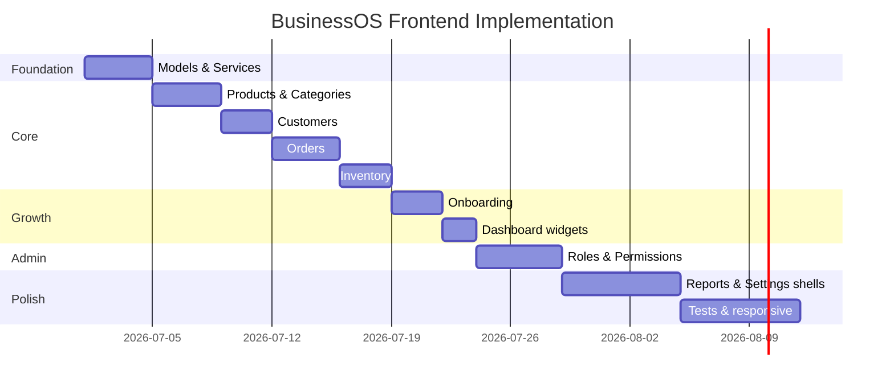

# BusinessOS Frontend Implementation Plan

> Sprint-by-sprint execution plan. **Do not start until planning docs are approved.**

---

## 1. Prerequisites

### Approved documents
- [x] frontend-roadmap.md
- [x] user-flows.md
- [x] api-mapping.md
- [x] application-pages.md
- [x] navigation-structure.md
- [x] database-entity-ui-mapping.md
- [x] onboarding-flow.md
- [x] permission-matrix.md
- [x] responsive-design-guide.md
- [x] implementation-plan.md (this document)

### Environment
- Angular 19.2.15, Bootstrap 5, SCSS
- API running locally (`BusinessOS.API`)
- `environment.ts` → `apiUrl` configured

---

## 2. Implementation Principles

1. **Module-by-module** — complete one domain before starting next
2. **API-first** — only build pages backed by existing endpoints (flag gaps)
3. **Reuse patterns** — first list page becomes template for all lists
4. **Signals over RxJS** where state is local (follow dashboard pattern)
5. **Tests with features** — service spec per module minimum
6. **No scope creep** — defer image upload, invoice API, user CRUD until backend ready

---

## 3. Phase Overview

| Phase | Duration | Deliverable |
|-------|----------|-------------|
| **0 — Foundation** | 3–4 days | Shared services, models, list/form patterns |
| **1 — Core ops** | 2 weeks | Products, Customers, Orders, Inventory |
| **2 — Onboarding** | 4–5 days | Wizard + dashboard enhancements |
| **3 — Admin** | 4–5 days | Roles, Permissions, partial Users |
| **4 — Reports & Invoices** | 1 week | Reports hub, print invoice, settings shells |
| **5 — Quality** | 1 week | Unit tests, Playwright, responsive pass |

**Total estimate:** ~6–7 weeks

---

## 4. Phase 0 — Foundation (Days 1–4)

### 0.1 TypeScript models
**Path:** `src/app/models/`

Create interfaces mirroring backend DTOs:
- `auth.model.ts`, `paged-result.model.ts` (extend existing)
- `category.model.ts`, `product.model.ts`, `customer.model.ts`
- `order.model.ts`, `inventory.model.ts`, `role.model.ts`
- `dashboard.model.ts` (verify against existing)

### 0.2 Domain API services
**Path:** `src/app/core/services/`

| Service | Methods |
|---------|---------|
| `CategoryService` | getAll, getById, create, update, delete |
| `ProductService` | getAll, getById, getByCategory, create, update, delete |
| `CustomerService` | getAll, getById, create, update, delete, getOrders, getAnalytics |
| `OrderService` | getAll, getById, create, update, delete, updateStatus |
| `InventoryService` | getAll, getByProductId, update, increase, decrease, adjust, getTransactions, getAnalytics, getLowStock, getOutOfStock, getReorder |
| `RoleService` | CRUD roles, assign/remove permissions, assign/remove user roles |
| `PermissionService` (auth helper) | hasPermission, hasAnyPermission |

Extend `BaseApiService` for HTTP + error mapping.

### 0.3 Shared list components
**Path:** `src/app/shared/components/`

| Component | Purpose |
|-----------|---------|
| `app-data-table` | Sortable table with mobile card mode |
| `app-search-bar` | Debounced search input |
| `app-confirm-dialog` | Delete/cancel confirmations |
| `app-status-badge` | Order/inventory status colors |
| `app-page-header` | Title + breadcrumb + primary action |

### 0.4 Navigation update
- Add Categories to `nav.constants.ts`
- Add contextual tab components

### 0.5 Error & permission pages
- `/forbidden` page
- `/not-found` page

**Exit criteria:** Services tested with mock HTTP; list pattern demo page works.

---

## 5. Phase 1 — Core Operations (Days 5–18)

### Sprint 1.1 — Products + Categories (Days 5–8)

| Task | Files |
|------|-------|
| Products list | `features/products/product-list/` |
| Product form (create/edit) | `features/products/product-form/` |
| Product detail | `features/products/product-detail/` |
| Categories list + form | `features/products/categories/` |
| Routes | `features/products/products.routes.ts` |
| Replace placeholder | Update `app-feature.routes.ts` |
| Unit tests | `product.service.spec.ts`, list component spec |

**API wiring:** All `/api/products` and `/api/categories` endpoints.

**UX:** Empty state, profit margin column, low stock badge, category filter.

---

### Sprint 1.2 — Customers (Days 9–11)

| Task | Files |
|------|-------|
| Customer list | `features/customers/customer-list/` |
| Customer form | `features/customers/customer-form/` |
| Customer detail (tabs) | `features/customers/customer-detail/` |
| Routes | `features/customers/customers.routes.ts` |

**API wiring:** All `/api/customers` endpoints.

**UX:** City/country filters, analytics cards on detail, orders tab.

---

### Sprint 1.3 — Orders (Days 12–15)

| Task | Files |
|------|-------|
| Order list | `features/orders/order-list/` |
| Order form (line items) | `features/orders/order-form/` |
| Order detail + status | `features/orders/order-detail/` |
| Print view | `features/orders/order-print/` |
| Routes | `features/orders/orders.routes.ts` |

**API wiring:** All `/api/orders` endpoints.

**UX:** Customer/product search selects, live totals, status FSM UI, edit lock banner.

**Complexity note:** Order form is highest complexity — allocate extra time.

---

### Sprint 1.4 — Inventory (Days 16–18)

| Task | Files |
|------|-------|
| Inventory list | `features/inventory/inventory-list/` |
| Stock detail + thresholds | `features/inventory/inventory-detail/` |
| Receive stock | `features/inventory/stock-receive/` |
| Adjust stock | `features/inventory/stock-adjust/` |
| Transaction history | `features/inventory/stock-transactions/` |
| Alerts page | `features/inventory/inventory-alerts/` |
| Routes | `features/inventory/inventory.routes.ts` |

**API wiring:** All `/api/inventory` endpoints.

---

## 6. Phase 2 — Onboarding & Dashboard (Days 19–23)

### Sprint 2.1 — Onboarding wizard (Days 19–21)

| Task | Route |
|------|-------|
| Onboarding layout + state service | `/onboarding` |
| Steps 0–8 | See onboarding-flow.md |
| Onboarding guard | Redirect logic |
| Register redirect change | → `/onboarding` not `/dashboard` |

**API steps:** Category, Product, Customer, Order (steps 4–7).

**Draft steps:** Business, Settings, Branding → localStorage.

---

### Sprint 2.2 — Dashboard enhancements (Days 22–23)

| Widget | API |
|--------|-----|
| Low stock alert card + link | `/inventory/low-stock` |
| Pending orders card | `/dashboard/orders` |
| Quick actions bar | Permission-filtered |
| Incomplete onboarding banner | localStorage check |

---

## 7. Phase 3 — Admin (Days 24–28)

### Sprint 3.1 — Roles & Permissions (Days 24–26)

| Page | API |
|------|-----|
| Roles list | `GET /roles` |
| Role form | POST, PUT, DELETE |
| Permission matrix | Assign/remove permissions |
| Permissions catalog | `GET /permissions` |

**Component:** Checkbox grid grouped by category.

---

### Sprint 3.2 — Users (Days 27–28)

| Page | Status |
|------|--------|
| Users list | **Blocked** — show empty state + "User management coming soon" |
| Role assignment | Wire `POST/DELETE /users/{id}/roles` if userId known |

**Do not build** invite/create user until backend ships.

---

## 8. Phase 4 — Reports, Invoices, Settings (Days 29–35)

### Sprint 4.1 — Reports hub (Days 29–31)

| Page | API |
|------|-----|
| Reports hub | Navigation only |
| Sales report | `/dashboard/sales`, charts/revenue |
| Inventory report | `/dashboard/inventory` |
| Customer report | `/dashboard/customers` |
| Product report | `/dashboard/products` |
| Profit report | Client-side: revenue - cost estimate |

**Shared:** Date range picker component (`period` query param).

**Export:** Client-side CSV (Phase 4), PDF via jsPDF (Phase 5).

---

### Sprint 4.2 — Invoices interim (Days 32–33)

| Page | Approach |
|------|----------|
| Invoice list | List completed orders with "Invoice" label |
| Invoice view | Reuse `order-print` with invoice template |
| `/invoices` route | Redirect or filtered order list |

**Mark UI:** "Full invoicing coming soon" banner.

---

### Sprint 4.3 — Settings shells (Days 34–35)

| Page | Approach |
|------|----------|
| Settings hub | Tab navigation |
| Business profile form | Bind to onboarding draft; save local |
| Preferences form | Currency, timezone, tax defaults local |
| Invoice settings | UI mock only |

**Banner on all settings pages:** "Changes will sync when cloud settings are enabled."

---

## 9. Phase 5 — Quality & Launch (Days 36–42)

### 9.1 Unit tests
| Area | Target |
|------|--------|
| All services | HTTP mock tests |
| Guards | auth, permission, onboarding |
| Order form | Total calculation logic |
| Permission service | hasPermission checks |

### 9.2 Playwright E2E
**Path:** `e2e/`

| Spec | Flow |
|------|------|
| `auth.spec.ts` | Register → login → logout |
| `onboarding.spec.ts` | Complete wizard with API mocks or test tenant |
| `sales-flow.spec.ts` | Product → customer → order |
| `inventory.spec.ts` | Receive stock → verify level |
| `permissions.spec.ts` | Viewer cannot see create buttons |

### 9.3 Responsive pass
- Test all modules at 375, 768, 1280px
- Fix table → card breakpoints
- Print stylesheet for order/invoice

### 9.4 Performance
- Verify lazy loading (network tab)
- Lighthouse score target: Performance >80, Accessibility >90

---

## 10. File Structure (Target)

```
src/app/
├── core/
│   ├── services/
│   │   ├── category.service.ts
│   │   ├── product.service.ts
│   │   ├── customer.service.ts
│   │   ├── order.service.ts
│   │   ├── inventory.service.ts
│   │   ├── role.service.ts
│   │   └── permission.service.ts
│   └── guards/
│       └── onboarding.guard.ts
├── features/
│   ├── products/
│   ├── customers/
│   ├── orders/
│   ├── inventory/
│   ├── onboarding/
│   ├── reports/
│   ├── invoices/
│   ├── settings/
│   └── admin/
├── models/
└── shared/components/
    ├── app-data-table/
    ├── app-confirm-dialog/
    ├── app-page-header/
    └── app-date-range-picker/
```

---

## 11. Definition of Done (Per Module)

- [ ] All CRUD pages functional against real API
- [ ] Permissions hide unauthorized actions
- [ ] Empty, loading, error states implemented
- [ ] Toast on success/error mutations
- [ ] Confirm dialog on destructive actions
- [ ] Responsive at 375px and 1280px
- [ ] Service unit tests passing
- [ ] Routes lazy-loaded
- [ ] Placeholder `feature-page` replaced
- [ ] Breadcrumbs correct

---

## 12. Backend Dependencies (Track Separately)

| Feature | Backend needed | Frontend blocked? |
|---------|----------------|-------------------|
| User list/invite | `GET/POST /users` | Partially |
| Settings persist | `PUT /tenants/current` | No — local draft OK |
| Invoices | Payment/Invoice API | No — order print interim |
| Forgot password | Auth endpoints | No — degraded UI exists |
| Product images | File upload API | No — disabled field |
| Email verification | Auth endpoint | No — skip step |

**Recommend parallel backend stories** for Tenant settings and User CRUD in Phase 2–3.

---

## 13. Risk Register

| Risk | Mitigation |
|------|------------|
| Order form complexity | Build incrementally; E2E early |
| Manager lacks Category permission | Document; Admin creates categories |
| No user list for role assign | Defer users page; roles work standalone |
| Tax as flat amount not % | UI label clarity; settings % as helper calc only |
| Large product lists | Pagination enforced; virtual scroll later |

---

## 14. Implementation Order Diagram



---

## 15. First Implementation Task (After Approval)

**Start here:**

1. Create `src/app/models/` DTO interfaces
2. Implement `CategoryService` + `ProductService`
3. Build shared `app-data-table` and `app-page-header`
4. Replace `/products` placeholder with product list page

**Command to verify:**
```bash
cd BusinessOS.Web
npm test -- --watch=false
npx playwright test
ng serve
```

---

## 16. Sign-Off

| Stakeholder | Approval | Date |
|-------------|----------|------|
| Product owner | ☐ Pending | |
| Tech lead | ☐ Pending | |
| UX review | ☐ Pending | |

**Once signed off:** Begin Phase 0 implementation module-by-module per this plan.
