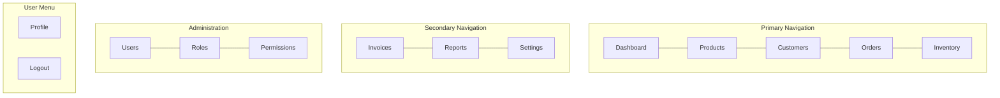

# BusinessOS Navigation Structure

> Sidebar, navbar, breadcrumbs, and route hierarchy for the Angular SPA.

---

## 1. Information Architecture



---

## 2. Sidebar Navigation

### Structure (desktop ≥992px)

| Order | Label | Icon | Route | Permissions | Status |
|-------|-------|------|-------|-------------|--------|
| 1 | Dashboard | 📊 | `/dashboard` | — (authenticated) | ✅ |
| 2 | Products | 📦 | `/products` | `Product.View` | 🚧 |
| 2a | └ Categories | 🏷️ | `/products/categories` | `Category.View` | 📋 NEW |
| 3 | Customers | 🤝 | `/customers` | `Customer.View` | 🚧 |
| 4 | Orders | 🛒 | `/orders` | `Order.View` | 🚧 |
| 5 | Inventory | 🏭 | `/inventory` | `Inventory.View` | 🚧 |
| — | *divider* | | | | |
| 6 | Invoices | 🧾 | `/invoices` | `Order.View` | 🚧 |
| 7 | Reports | 📈 | `/reports` | `Order.View` | 🚧 |
| 8 | Settings | ⚙️ | `/settings` | — (Admin recommended) | 🚧 |
| — | *divider* | | | | |
| 9 | Users | 👥 | `/users` | `User.View` | 🚧 |
| 10 | Roles | 🛡️ | `/roles` | `Role.View` | 🚧 |
| 11 | Permissions | 🔐 | `/permissions` | `Role.View` | 🚧 |

**Filtering logic:** `NAV_ITEMS.filter(item => hasAnyPermission(item.permissions))` — already in `app-navbar.component.ts`.

**Categories addition:** Extend `nav.constants.ts`:

```typescript
{
  label: 'Categories',
  icon: '🏷️',
  route: '/products/categories',
  description: 'Organize products into categories.',
  permissions: ['Category.View'],
  parentRoute: '/products',  // nested visual indent
}
```

---

## 3. Top Navbar

| Zone | Content | Behavior |
|------|---------|----------|
| Left | Hamburger (mobile), breadcrumb | Toggle sidebar collapse |
| Center | Global search (Phase 2) | Search products, customers, orders |
| Right | Notifications bell (future), user avatar dropdown | Profile, Settings, Logout |

### User dropdown menu

| Item | Route | Visible when |
|------|-------|--------------|
| My Profile | `/profile` | Always |
| Settings | `/settings` | Admin or always |
| Help & Support | external/docs | Always |
| Sign out | `/auth/login` | Always |

---

## 4. Breadcrumb Hierarchy

| Route | Breadcrumb trail |
|-------|------------------|
| `/dashboard` | Home |
| `/products` | Home › Products |
| `/products/new` | Home › Products › New Product |
| `/products/:id` | Home › Products › {productName} |
| `/products/:id/edit` | Home › Products › {productName} › Edit |
| `/products/categories` | Home › Products › Categories |
| `/customers` | Home › Customers |
| `/customers/:id` | Home › Customers › {fullName} |
| `/orders` | Home › Orders |
| `/orders/:id` | Home › Orders › {orderNumber} |
| `/inventory` | Home › Inventory |
| `/inventory/receive` | Home › Inventory › Receive Stock |
| `/inventory/transactions` | Home › Inventory › History |
| `/reports/sales` | Home › Reports › Sales |
| `/settings/business` | Home › Settings › Business Profile |
| `/roles/:id/permissions` | Home › Roles › {roleName} › Permissions |
| `/onboarding/product` | Setup › Add First Product |

**Implementation:** Route `data.breadcrumb` static + resolver for dynamic entity names.

---

## 5. Mobile Navigation (<992px)

- Sidebar becomes off-canvas drawer (Bootstrap offcanvas)
- Hamburger opens drawer; tap outside closes
- Bottom sticky bar (optional Phase 2):

| Tab | Route |
|-----|-------|
| Home | `/dashboard` |
| Sell | `/orders/new` |
| Stock | `/inventory` |
| More | Opens drawer |

---

## 6. Route Guard Matrix

| Guard | Applies to | Behavior |
|-------|------------|----------|
| `authGuard` | All dashboard layout routes | Redirect to `/auth/login` |
| `permissionGuard(['X.View'])` | Feature routes | Redirect to `/forbidden` or dashboard |
| `onboardingGuard` | Dashboard routes (optional) | Redirect to `/onboarding` if incomplete |
| `guestGuard` | Auth routes | Redirect to `/dashboard` if logged in |

---

## 7. Quick Actions (Dashboard + Navbar)

Floating or header buttons for high-frequency tasks:

| Action | Route | Permission | Icon |
|--------|-------|------------|------|
| New order | `/orders/new` | `Order.Create` | + Order |
| New customer | `/customers/new` | `Customer.Create` | + Customer |
| New product | `/products/new` | `Product.Create` | + Product |
| Receive stock | `/inventory/receive` | `Inventory.Adjust` | + Stock |

Show only actions user has permission for.

---

## 8. Contextual Sub-Navigation

### Products section tabs (horizontal, below page title)

| Tab | Route |
|-----|-------|
| All Products | `/products` |
| Categories | `/products/categories` |

### Inventory section tabs

| Tab | Route |
|-----|-------|
| Stock Levels | `/inventory` |
| Receive | `/inventory/receive` |
| Adjust | `/inventory/adjust` |
| History | `/inventory/transactions` |
| Alerts | `/inventory/alerts` |

### Reports section tabs

| Tab | Route |
|-----|-------|
| Overview | `/reports` |
| Sales | `/reports/sales` |
| Inventory | `/reports/inventory` |
| Customers | `/reports/customers` |
| Products | `/reports/products` |
| Profit | `/reports/profit` |

### Settings section tabs

| Tab | Route |
|-----|-------|
| Business | `/settings/business` |
| Branding | `/settings/branding` |
| Preferences | `/settings/preferences` |
| Invoices | `/settings/invoices` |

---

## 9. URL Design Rules

- Lowercase kebab-case: `/products/categories`, not `/Products/Categories`
- Resource IDs as GUIDs: `/orders/a1b2c3d4-...`
- No trailing slashes
- Query params for filters: `/orders?status=Pending&page=2`
- `returnUrl` query on login redirect

---

## 10. Navigation State (Signals)

```typescript
// Proposed NavigationStateService
sidebarCollapsed = signal(false);
activeSection = computed(() => deriveFromUrl(router.url));
visibleNavItems = computed(() => filterByPermissions(NAV_ITEMS, auth.permissions()));
```

Persist `sidebarCollapsed` in localStorage.

---

## 11. Changes from Current Implementation

| Current | Proposed change |
|---------|-----------------|
| Categories absent from nav | Add under Products |
| Settings has no permission guard | Keep open; restrict sensitive tabs in component |
| Invoices uses `Order.View` | Correct until Invoice permissions exist |
| Profile not in NAV_ITEMS | Keep in user dropdown only |
| Wildcard redirects to dashboard | Add `/not-found` route before wildcard |

---

## 12. File References

| File | Purpose |
|------|---------|
| `shared/constants/nav.constants.ts` | NAV_ITEMS, APP_ROUTE_PATHS |
| `app.routes.ts` | Root routes, auth, layout |
| `app-feature.routes.ts` | Feature placeholder → real lazy modules |
| `core/guards/permission.guard.ts` | Permission-based access |
| `shared/components/app-navbar/` | Sidebar + top bar |
| `shared/components/app-breadcrumb/` | Breadcrumb trail |
