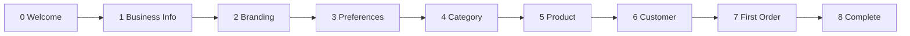

# BusinessOS Onboarding Flow

> Step-by-step first-run wizard for non-technical business owners migrating from manual tools.

---

## 1. Goals

1. **Reduce time-to-value** — first sale recorded within 15 minutes of registration
2. **Replace notebook setup** — capture business info once, reuse everywhere
3. **Build confidence** — guided steps with progress, not empty dashboard
4. **Never block** — every step skippable except registration itself

---

## 2. Trigger & Completion

| Event | Behavior |
|-------|----------|
| Successful register | Redirect to `/onboarding/welcome` (not dashboard) |
| Successful login + incomplete onboarding | Redirect to last incomplete step |
| Successful login + complete | Redirect to `/dashboard` |
| User clicks "Skip for now" | Mark step skipped; advance |
| User clicks "Skip all" | Set `onboardingCompleted=true`; go to dashboard |
| All required steps done | Show completion screen → dashboard |

**Storage (until backend flag):**
```typescript
interface OnboardingState {
  completed: boolean;
  currentStep: number;
  skippedSteps: number[];
  draft: {
    business?: BusinessDraft;
    settings?: SettingsDraft;
  };
}
// localStorage key: 'businessos_onboarding'
```

**Future:** `GET/PATCH /api/users/me/onboarding` or tenant settings.

---

## 3. Wizard Structure



| Step | Title | Required | API | Skippable |
|------|-------|----------|-----|-----------|
| 0 | Welcome | — | — | No (entry) |
| 1 | Business information | Recommended | ❌ draft only | Yes |
| 2 | Upload logo | Optional | ❌ local preview | Yes |
| 3 | Currency & tax settings | Recommended | ❌ draft only | Yes |
| 4 | Create first category | **Yes** for product | ✅ `POST /categories` | No if continuing to product |
| 5 | Add first product | Recommended | ✅ `POST /products` | Yes |
| 6 | Add first customer | Recommended | ✅ `POST /customers` | Yes |
| 7 | Create first order | Recommended | ✅ `POST /orders` | Yes |
| 8 | You're all set! | — | — | No (exit) |

---

## 4. Step Specifications

### Step 0 — Welcome

**Route:** `/onboarding/welcome`

**Content:**
- Headline: "Welcome to BusinessOS, {firstName}!"
- Subtext: "Let's set up your business in a few quick steps. Takes about 10 minutes."
- Illustration: shop/store graphic
- Checklist preview of upcoming steps
- Primary: "Get started"
- Secondary: "Skip setup, go to dashboard"

**UX:** No form validation.

---

### Step 1 — Business Information

**Route:** `/onboarding/business`

**Fields:**

| Field | Control | Required | Maps to |
|-------|---------|----------|---------|
| Business name | Text | Yes | Tenant.name (pre-filled from register) |
| Business type | Select | Yes | Tenant.businessType |
| Industry | Select | No | UI-only |
| Owner name | Text | Yes | firstName + lastName (read-only display) |
| Email | Email | Yes | Tenant.email |
| Phone | Tel | Yes | Tenant.phone |
| Address | Textarea | Yes | Tenant.address |
| City | Text | Yes | UI draft |
| Country | Country select | Yes | UI draft |
| Tax number | Text | No | UI draft |

**Help text:** "This appears on your invoices and reports."

**Actions:** Back · Skip · Save & continue

**API today:** Save to `onboarding.draft.business` only. Show info banner: "Business profile will sync when settings are enabled."

---

### Step 2 — Branding

**Route:** `/onboarding/branding`

**Fields:**

| Field | Control | Notes |
|-------|---------|-------|
| Logo | Drag-drop upload | Max 2MB, PNG/JPG; client preview only |

**Help text:** "Your logo appears on invoices and the sidebar."

**Skip default:** Most users skip — make skip prominent.

---

### Step 3 — Preferences (Settings)

**Route:** `/onboarding/settings`

**Fields:**

| Field | Control | Default | Help |
|-------|---------|---------|------|
| Currency | Select | USD | "Used for all prices and reports" |
| Timezone | Select | Auto-detect | "For order dates and reports" |
| Language | Select | English | "Interface language" |
| Tax percentage | Number % | 0 | "Default tax applied to new orders" |

**Note:** Tax on orders is currently a flat amount field (`Order.tax`), not percentage — wizard should explain: "You can adjust tax on each order."

---

### Step 4 — First Category

**Route:** `/onboarding/category`

**Fields:**

| Field | Required |
|-------|----------|
| Category name | Yes |
| Description | No |

**Suggested chips:** "General", "Electronics", "Clothing", "Food", "Services" — tap to pre-fill.

**API:** `POST /categories` on continue.

**Empty state tip:** "Categories help organize your products — like aisles in your shop."

---

### Step 5 — First Product

**Route:** `/onboarding/product`

**Simplified fields (full form available later):**

| Field | Required |
|-------|----------|
| Category | Pre-selected from step 4 |
| Product name | Yes |
| SKU | Yes (auto-suggest from name) |
| Cost price | Yes |
| Selling price | Yes |
| Starting stock | Yes → maps to receive stock after create |
| Reorder level | No (default 5) |

**API:** `POST /products` then optional `POST /inventory/increase` if starting stock > 0.

**Computed display:** Profit margin shown live.

---

### Step 6 — First Customer

**Route:** `/onboarding/customer`

**Minimum fields:**

| Field | Required |
|-------|----------|
| First name | Yes |
| Last name | Yes |
| Phone | Yes |
| Email | Yes |
| Country | Yes |

**Optional expand:** Address, city, postal code.

**API:** `POST /customers`

**Tip:** "You'll need at least one customer to record a sale."

---

### Step 7 — First Order

**Route:** `/onboarding/order`

**Pre-filled:**
- Customer from step 6 (or picker if skipped)
- Product from step 5 (or picker)

**Fields:**

| Field | Control |
|-------|---------|
| Customer | Read-only or select |
| Product + quantity | Line item |
| Discount | Optional, default 0 |
| Tax | Optional, default from step 3 draft |

**Summary panel:** Subtotal, discount, tax, grand total (live).

**API:** `POST /orders`

**Success micro-copy:** "Congratulations — you've recorded your first sale!"

**Secondary action:** "Print receipt" → print view.

---

### Step 8 — Complete

**Route:** `/onboarding/complete`

**Content:**
- Celebration illustration
- Summary checklist with ✅ for completed steps
- "What's next" cards:
  - Explore dashboard
  - Add more products
  - Invite team member (disabled until user API)
- Primary: "Go to dashboard"

**Set:** `onboardingCompleted = true`

---

## 5. Wizard Chrome (Shared Layout)

```
┌──────────────────────────────────────────────────┐
│  BusinessOS          Step 3 of 8    [Skip all]   │
├──────────────────────────────────────────────────┤
│  ●──●──●──○──○──○──○──○   Progress bar           │
├──────────────────────────────────────────────────┤
│                                                  │
│              { Step content }                    │
│                                                  │
├──────────────────────────────────────────────────┤
│  [← Back]              [Skip]  [Continue →]      │
└──────────────────────────────────────────────────┘
```

**Layout:** Full-screen centered card on auth-style background (no sidebar).

**Component:** `OnboardingLayoutComponent` with `<router-outlet>` for steps.

---

## 6. Validation & Error Handling

| Error | UX |
|-------|-----|
| Category name duplicate (409) | Inline: "A category with this name already exists" |
| Product SKU conflict | Inline field error |
| Customer email duplicate | Inline field error |
| Order insufficient stock | Highlight quantity; suggest reduce or receive stock |
| API network failure | Toast + "Retry" on same step |

---

## 7. Email Verification (Future)

When backend adds verification:

| Step | Insert after |
|------|--------------|
| Check email inbox | Register (step 1.5) |
| Resend verification | Link on banner |
| Block order creation? | No — soft banner only |

**Current:** Omit verification step entirely.

---

## 8. Re-entry & Resume

| Scenario | Behavior |
|----------|----------|
| User refreshes mid-wizard | Resume `currentStep` from localStorage |
| User skips all, returns later | Settings → "Complete setup" link |
| Admin completes for multi-user tenant | Each user skips business steps; owner-only |

**Dashboard banner (incomplete onboarding):**
> "Finish setting up your business — 3 steps remaining" [Continue setup]

---

## 9. Accessibility

- Progress announced to screen readers: "Step 3 of 8, Business settings"
- Focus moves to step heading on navigation
- Skip links keyboard accessible
- Form errors linked via `aria-describedby`

---

## 10. Analytics Events (Future)

| Event | Payload |
|-------|---------|
| `onboarding_started` | tenantId |
| `onboarding_step_completed` | step number |
| `onboarding_skipped` | step number |
| `onboarding_completed` | duration seconds |
| `onboarding_first_order` | orderId |

---

## 11. Implementation Files (Planned)

```
features/onboarding/
├── onboarding.routes.ts
├── onboarding-layout/
├── onboarding-state.service.ts      # signals + localStorage
├── onboarding.guard.ts
├── welcome/
├── business-info/
├── branding/
├── preferences/
├── category/
├── product/
├── customer/
├── first-order/
└── complete/
```

---

## 12. Acceptance Criteria

- [ ] New user lands on wizard after register, not empty dashboard
- [ ] Can complete full path using only existing APIs (steps 4–7)
- [ ] Business/settings steps persist draft locally
- [ ] Skip all reaches dashboard without errors
- [ ] Returning user with `completed=true` never sees wizard
- [ ] Mobile: wizard usable on 375px width
- [ ] All steps have loading, error, and empty states
