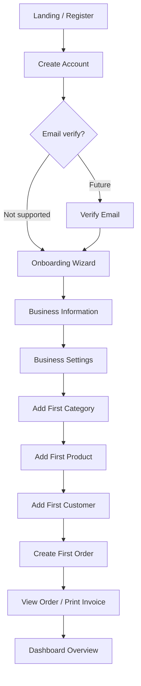
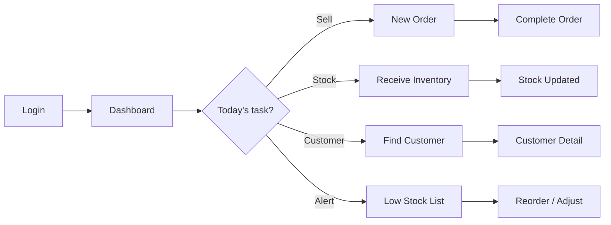
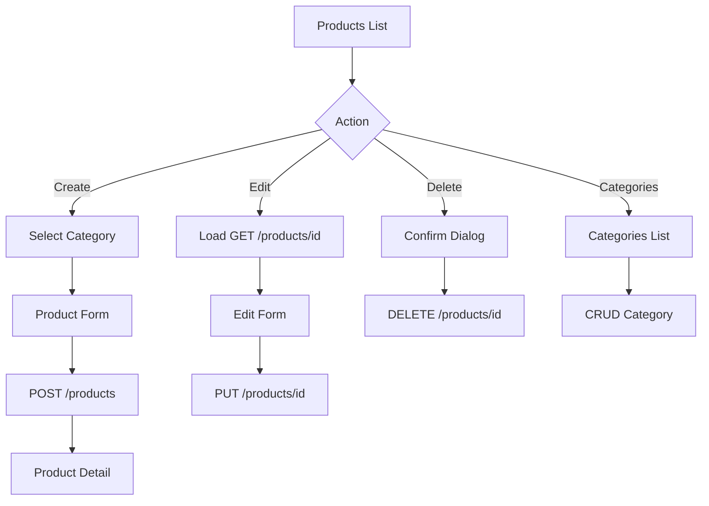
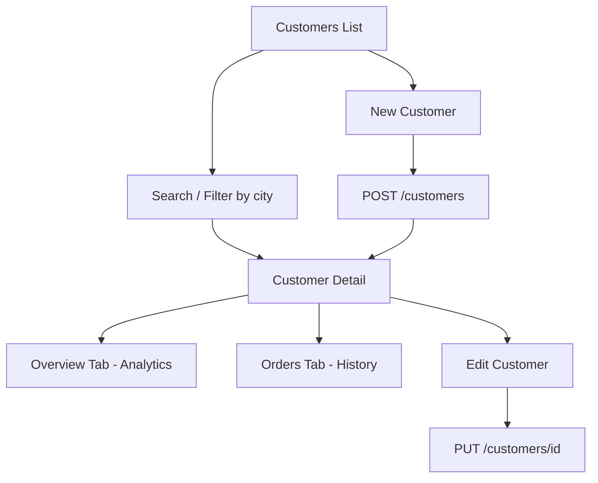
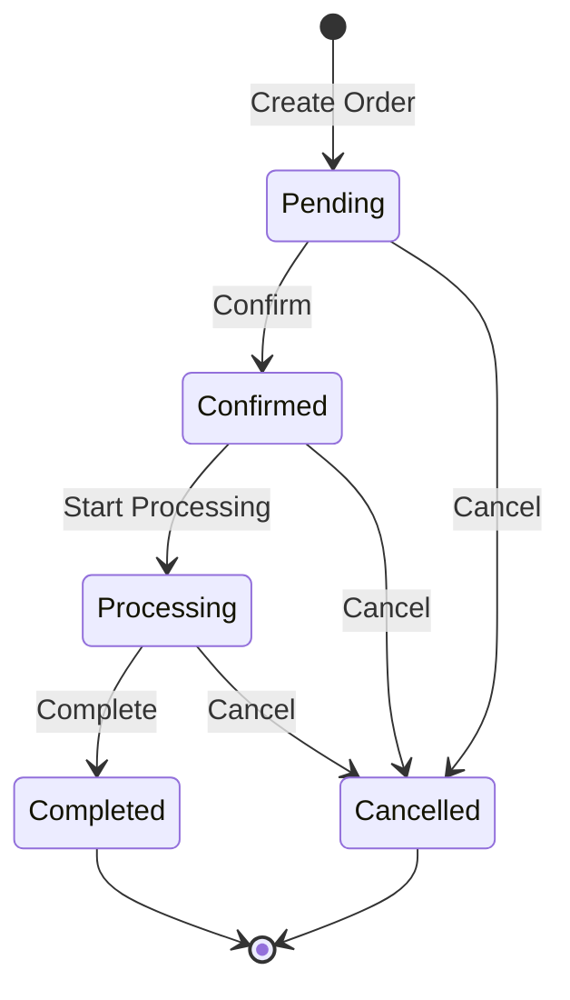
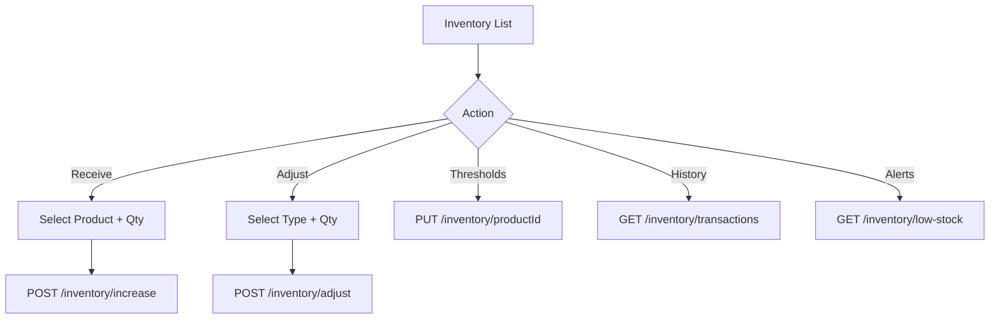
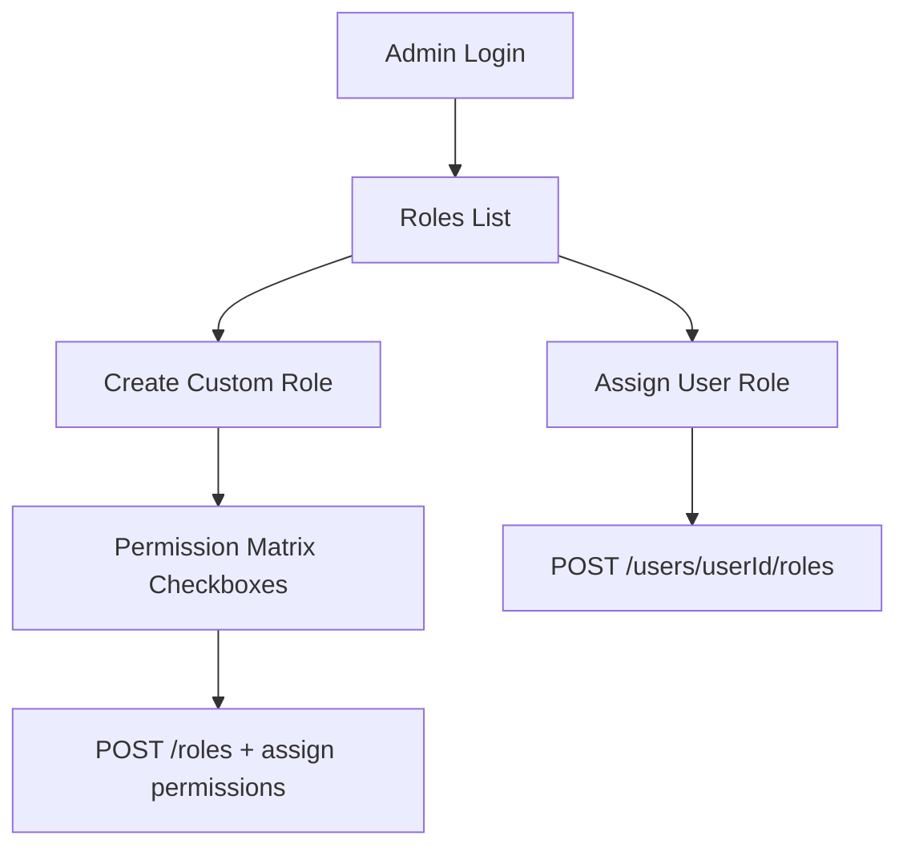
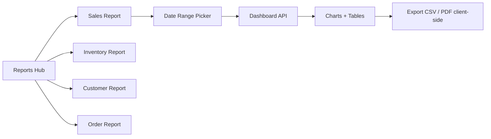

# BusinessOS User Flows

> End-to-end journeys for shop owners and staff. Each flow maps to routes, APIs, and UX states.

---

## 1. New User Flow (Primary Journey)

The happy path from signup to first invoice view.



### Step detail

| Step | User action | Route | API | Notes |
|------|-------------|-------|-----|-------|
| 1 | Register account | `/auth/register` | `POST /auth/register` | Collects name, email, password, business name |
| 2 | Verify email | — | ❌ Not implemented | Skip; show banner "Verify later" when API ships |
| 3 | Login | `/auth/login` | `POST /auth/login` | Auto-login after register today |
| 4 | Onboarding welcome | `/onboarding` | — | Progress stepper, skippable after step 1 |
| 5 | Business profile | `/onboarding/business` | ❌ Future `PUT /tenants` | Capture type, industry, address, tax # |
| 6 | Business settings | `/onboarding/settings` | ❌ Future | Currency, timezone, tax % |
| 7 | Upload logo | `/onboarding/branding` | ❌ Future | Optional; local preview until API |
| 8 | Add category | `/onboarding/category` | `POST /categories` | Required before product |
| 9 | Add product | `/onboarding/product` | `POST /products` | Simplified form: name, SKU, prices, stock |
| 10 | Add customer | `/onboarding/customer` | `POST /customers` | Minimum: name, phone, email |
| 11 | Create order | `/onboarding/order` | `POST /orders` | Pre-select new customer + product |
| 12 | View invoice | `/orders/:id` | `GET /orders/:id` | Print-friendly view (interim invoice) |
| 13 | Dashboard | `/dashboard` | `GET /dashboard/overview` | Celebration empty state → populated widgets |

**Completion trigger:** Store `onboardingCompleted=true` in localStorage until Settings API persists it.

---

## 2. Returning User — Daily Operations



| Task | Entry point | Key APIs |
|------|-------------|----------|
| Check sales | Dashboard → Today sales card | `/dashboard/sales` |
| Create sale | Orders → New | `/orders`, `/customers`, `/products` |
| Receive delivery | Inventory → Receive stock | `/inventory/increase` |
| Follow up customer | Customers → Search | `/customers?search=` |
| Fix stock count | Inventory → Adjust | `/inventory/adjust` |

---

## 3. Authentication Flows

### 3.1 Login

```
/auth/login
  → Submit email + password
  → POST /auth/login
  → Store token, tenantId, permissions in TokenService
  → Redirect: /dashboard (or /onboarding if incomplete)
```

**Error states:**
- 401 → "Email or password is incorrect"
- 400 → Show field validation from `errors` object
- Network → Retry banner

### 3.2 Register

```
/auth/register
  → Submit registration form
  → POST /auth/register
  → Auto-store JWT
  → Redirect: /onboarding (not dashboard)
```

### 3.3 Logout

```
Navbar → Sign out
  → Clear TokenService
  → Redirect: /auth/login
```

### 3.4 Forgot password (degraded)

```
/auth/forgot-password
  → POST /auth/forgot-password
  → If 404: "Password reset is not available yet. Contact your administrator."
  → If success (future): "Check your email"
```

### 3.5 Session expiry

```
API returns 401
  → Interceptor clears token
  → Toast: "Your session expired. Please sign in again."
  → Redirect: /auth/login?returnUrl={current}
```

---

## 4. Product Management Flow



**Search/filter flow:**
- User types in search → debounce 300ms → `GET /products?search=`
- Category filter → `GET /products?categoryId=`
- Low stock filter → client filter on `currentStock <= reorderLevel`

---

## 5. Customer Management Flow



**Purchase history:** `GET /customers/{id}/orders` with pagination.

**Outstanding balance:** Not in API — show `totalSpending` from analytics with label "Total spent" (not "Balance due").

---

## 6. Order Lifecycle Flow



**Create order UX:**
1. Select customer (searchable dropdown)
2. Add line items (product search, quantity, live subtotal)
3. Enter discount + tax (optional)
4. Review totals → Submit
5. Success → Order detail with status badge

**Edit restrictions:** Show read-only banner when status is Processing, Completed, or Cancelled.

**Generate invoice (interim):** Order detail → "Print invoice" → browser print CSS.

---

## 7. Inventory Flow



**Transfer stock:** Use adjust with `transactionType: Transfer` — single-location today (no warehouse picker).

---

## 8. Admin / RBAC Flow



**Blocked today:** Cannot list users — Admin must know `userId` from registration response or future user list API.

---

## 9. Reports Flow



**Export:** No backend export endpoints — use client libraries (e.g. `xlsx`, `jspdf`) on chart/table data.

---

## 10. Error & Edge Case Flows

| Scenario | User sees | System behavior |
|----------|-----------|-----------------|
| No products yet | Empty state + "Add product" CTA | `items.length === 0` |
| Insufficient stock on order | Inline error on line item | API 409/400 with message |
| Duplicate customer email | Field error on email | API 409 |
| Delete category with products | Toast error | API 409 |
| Permission denied | 403 page or redirect | `permissionGuard` |
| Missing tenant header | Rare — interceptor handles | API 400 `TENANT_HEADER_REQUIRED` |
| Offline | Banner "No connection" | Failed fetch, retry button |

---

## 11. Persona-Specific Short Paths

### Shop owner (Admin)
Register → Onboarding → Dashboard → Add team member (future) → Review weekly sales report

### Sales staff (Sales role)
Login → Orders → New order → Complete → Print receipt

### Inventory clerk (InventoryManager)
Login → Inventory alerts → Receive stock → View transaction log

### Read-only accountant (Viewer)
Login → Dashboard → Reports → Export CSV

---

## 12. Flow → Document Cross-Reference

| Flow | Primary doc |
|------|-------------|
| Onboarding steps | [onboarding-flow.md](./onboarding-flow.md) |
| Page routes | [application-pages.md](./application-pages.md) |
| API calls | [api-mapping.md](./api-mapping.md) |
| Nav entry points | [navigation-structure.md](./navigation-structure.md) |
| Role access | [permission-matrix.md](./permission-matrix.md) |
